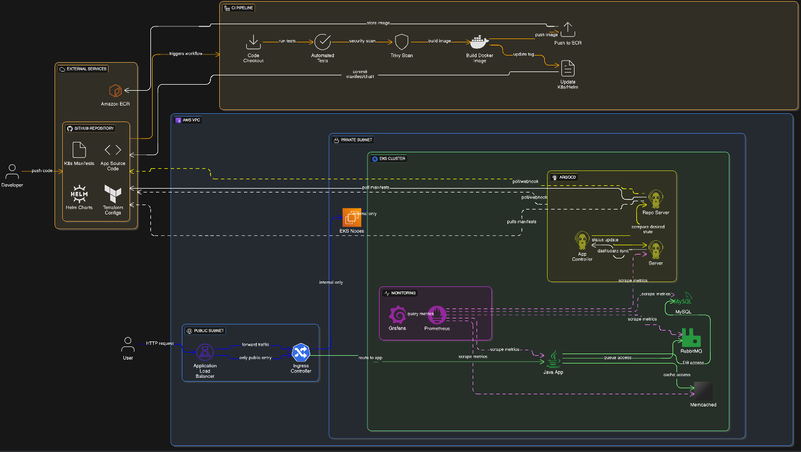

# 🚀 GitOps Infrastructure - EKS with ArgoCD

> **Kubernetes deployment using GitOps principles, Terraform IaC, and automated CI/CD pipelines**

[](https://kubernetes.io/)
[](https://argoproj.github.io/cd/)
[](https://www.terraform.io/)

### Key Principles

✅ **GitOps-First**: All infrastructure and application changes flow through Git  
✅ **Security by Design**: Network isolation, vulnerability scanning, and least-privilege access  
✅ **Observability**: Comprehensive monitoring with Prometheus and Grafana  
✅ **Automation**: Fully automated CI/CD pipeline from code commit to production

## 🏗️ Architecture

### High-Level Architecture Diagram



> **💡 How to add this diagram:**
>
> 1. Open `gitops-architecture-diagram.html` in your browser
> 2. Take a full-page screenshot (use browser dev tools or extensions like "Full Page Screen Capture")
> 3. Save as `architecture-diagram.png` in a `docs/` folder
> 4. The image will automatically appear above!

### Architecture Components

#### **AWS Infrastructure**

- **VPC** with public and private subnets
- **Public Subnet**: Application Load Balancer (ALB) for internet-facing traffic
- **Private Subnet**: EKS worker nodes (isolated from direct internet access)

#### **Kubernetes Cluster (EKS)**

- **Application Services**:

  - Java Application (main service)
  - Memcached (distributed caching)
  - MySQL (relational database)
  - RabbitMQ (message broker)

- **GitOps Controller**:

  - ArgoCD Server (UI and API)
  - Application Controller (reconciliation engine)
  - Repo Server (Git repository interface)

- **Monitoring Stack**:
  - Prometheus (metrics collection and alerting)
  - Grafana (visualization and dashboards)

#### **External Services**

- **GitHub**: Source code, manifests, and Helm charts
- **Amazon ECR**: Container image registry
- **GitHub Actions**: CI pipeline automation

## ✨ Features

### 🔄 Continuous Deployment

- **GitOps Workflow**: ArgoCD automatically syncs cluster state with Git
- **Automated Rollbacks**: Easy rollback to previous versions via Git
- **Health Checks**: Automatic deployment verification and status reporting

### 🔒 Security

- **Network Isolation**: EKS nodes in private subnet with no direct internet access
- **Container Scanning**: Trivy scans all images for vulnerabilities before deployment
- **Secrets Management**: Kubernetes secrets with encryption at rest

### 📊 Observability

- **Metrics**: Prometheus scrapes all services including ArgoCD
- **Dashboards**: Pre-configured Grafana dashboards for apps and infrastructure
- **Alerting**: Prometheus AlertManager for proactive issue detection
- **Logging**: (Optional) ELK/EFK stack for centralized logging

### 🛠️ Infrastructure as Code

- **Terraform**: All AWS resources defined as code
- **Helm Charts**: Parameterized Kubernetes deployments
- **Version Control**: Complete infrastructure history in Git

## 🔧 Tech Stack

### Infrastructure & Orchestration

- **Cloud Provider**: AWS (EKS, VPC, ALB, ECR)
- **IaC**: Terraform
- **Container Orchestration**: Kubernetes (EKS)
- **Package Manager**: Helm

### CI/CD & GitOps

- **CI Pipeline**: GitHub Actions
- **GitOps Tool**: ArgoCD
- **Container Registry**: Amazon ECR
- **Security Scanning**: Trivy

### Application Stack

- **Application**: Java
- **Caching**: Memcached
- **Database**: MySQL
- **Message Queue**: RabbitMQ

### Monitoring & Observability

- **Metrics**: Prometheus
- **Visualization**: Grafana
- **Alerting**: Prometheus AlertManager

## 📦 Prerequisites

Before getting started, ensure you have the following installed:

```bash
# Required Tools
- AWS CLI (v2+)
- kubectl (v1.28+)
- Terraform (v1.5+)
- Helm (v3.12+)
- Docker (v20+)
- ArgoCD CLI (v2.8+)

# Required Access
- AWS Account with appropriate permissions
- GitHub account with repository access
- AWS ECR repository created
```

### AWS Permissions Required

- EKS cluster creation/management
- VPC and networking resources
- IAM roles and policies
- ECR repository access
- Load Balancer management

## 🚀 Getting Started

### 1. Clone the Repository

```bash
git clone https://github.com/your-username/gitops-eks-infrastructure.git
cd gitops-eks-infrastructure
```

### 2. Configure AWS Credentials

```bash
aws configure
# Enter your AWS Access Key ID, Secret Key, and default region
```

### 3. Initialize Terraform

```bash
cd terraform/
terraform init
terraform plan
terraform apply
```

This will provision:

- VPC with public/private subnets
- EKS cluster
- Security groups
- IAM roles
- ECR repository

### 4. Configure kubectl

```bash
aws eks update-kubeconfig --name your-cluster-name --region your-region
kubectl get nodes
```

### 5. Install ArgoCD

```bash
kubectl create namespace argocd
kubectl apply -n argocd -f https://raw.githubusercontent.com/argoproj/argo-cd/stable/manifests/install.yaml

# Wait for ArgoCD to be ready
kubectl wait --for=condition=available --timeout=300s deployment/argocd-server -n argocd

# Get ArgoCD admin password
kubectl -n argocd get secret argocd-initial-admin-secret -o jsonpath="{.data.password}" | base64 -d
```

### 6. Access ArgoCD UI

```bash
# Port forward to access locally
kubectl port-forward svc/argocd-server -n argocd 8080:443

# Access at: https://localhost:8080
# Username: admin
# Password: (from step 5)
```

### 7. Deploy Application with ArgoCD

```bash
# Create ArgoCD application
kubectl apply -f argocd/application.yaml

# Or via ArgoCD CLI
argocd app create my-app \
  --repo https://github.com/your-username/gitops-eks-infrastructure.git \
  --path k8s/manifests \
  --dest-server https://kubernetes.default.svc \
  --dest-namespace default \
  --sync-policy automated
```

### 8. Install Monitoring Stack

```bash
# Install Prometheus & Grafana using Helm
helm repo add prometheus-community https://prometheus-community.github.io/helm-charts
helm repo update

helm install prometheus prometheus-community/kube-prometheus-stack \
  --namespace monitoring \
  --create-namespace \
  --values helm/monitoring/values.yaml
```

## 🔄 CI/CD Pipeline

### Pipeline Flow

```
┌─────────────┐
│ Code Commit │
└──────┬──────┘
       │
       ▼
┌─────────────────┐
│ GitHub Actions  │
│   (CI Stage)    │
├─────────────────┤
│ 1. Checkout     │
│ 2. Run Tests    │
│ 3. Trivy Scan   │
│ 4. Build Image  │
│ 5. Push to ECR  │
│ 6. Update Tag   │
└──────┬──────────┘
       │
       ▼
┌─────────────────┐
│   Git Repo      │
│ (Manifest Updated)
└──────┬──────────┘
       │
       ▼
┌─────────────────┐
│    ArgoCD       │
│  (CD Stage)     │
├─────────────────┤
│ 1. Detect Change│
│ 2. Pull Manifest│
│ 3. Pull Image   │
│ 4. Deploy to K8s│
│ 5. Health Check │
└─────────────────┘
```

### GitHub Actions Workflow

The CI pipeline is triggered on every push to `main` branch:

```yaml
# .github/workflows/ci-cd.yaml
name: CI/CD Pipeline

on:
  push:
    branches: [main]

jobs:
  build-and-deploy:
    runs-on: ubuntu-latest
    steps:
      - name: Checkout code
      - name: Run tests
      - name: Security scan with Trivy
      - name: Build Docker image
      - name: Push to ECR
      - name: Update Kubernetes manifest
```

### ArgoCD Continuous Deployment

ArgoCD continuously monitors the Git repository and automatically syncs changes:

- **Auto-Sync**: Enabled for automatic deployment
- **Self-Heal**: Automatically corrects drift from desired state
- **Prune**: Removes resources deleted from Git
- **Sync Waves**: Controls deployment order

## 📊 Monitoring & Observability

### Prometheus Metrics

Prometheus scrapes metrics from:

- Application pods (via service monitors)
- Kubernetes cluster metrics
- ArgoCD metrics
- Node exporter metrics

**Access Prometheus UI:**

```bash
kubectl port-forward -n monitoring svc/prometheus-kube-prometheus-prometheus 9090:9090
# Visit: http://localhost:9090
```

### Grafana Dashboards

Pre-configured dashboards for:

- **Kubernetes Cluster Overview**: Node/pod metrics, resource usage
- **Application Metrics**: Request rates, latencies, error rates
- **ArgoCD Dashboard**: Sync status, app health
- **Database Monitoring**: MySQL performance metrics

**Access Grafana:**

```bash
kubectl port-forward -n monitoring svc/prometheus-grafana 3000:80
# Visit: http://localhost:3000
# Default credentials: admin/prom-operator
```
